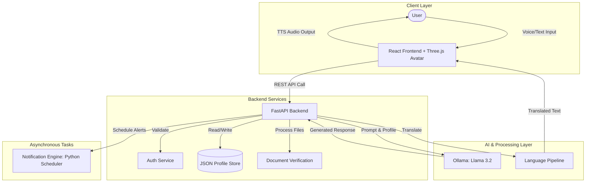
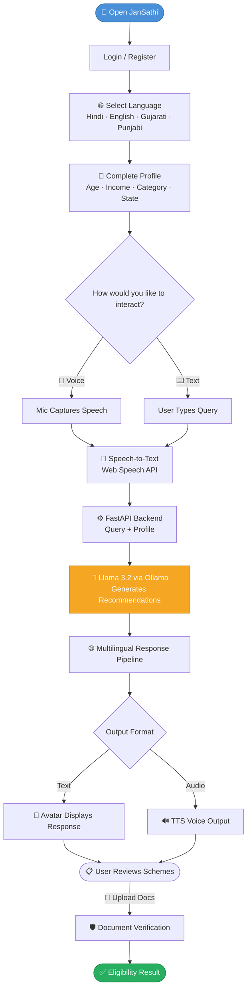

<div align="center">

# 🏛️ JanSaathi

### AI-Powered Citizen Assistance Platform

*Helping Indian citizens discover government schemes through multilingual, voice-first AI*

<br/>


</div>

---

## 📖 Overview

**JanSathi** *(Jan = People, Sathi = Companion)* is a citizen assistance platform built to bridge the gap between government welfare schemes and the people they serve.

- 🎤 Users interact via **voice or text** in their preferred language
- 🧠 A **local LLM (Llama 3.2 via Ollama)** processes queries and recommends schemes
- 👤 A **3D avatar** provides a conversational, accessible interface
- 🌐 Currently supports **Hindi, English, Gujarati, and Punjabi**

> ⚠️ This project is under active development. Features marked 🚧 are not yet available.

---

## ✅ Implemented Features

| Feature | Description |
|---|---|
|  **Voice Input & Output** | Speech-to-text and text-to-speech via the browser's Web Speech API |
|  **4-Language Support** | Hindi, English, Gujarati, and Punjabi across UI, STT, and TTS |
|  **3D Avatar (Saathi)** | GLB-based animated avatar rendered with Three.js |
|  **Scheme Personalization** | Recommendations filtered by age, income, category, and state |
|  **Document Verification** | Upload and check document eligibility for schemes |
|  **Authentication** | User login and session management via API |
|  **Notification Engine** | Standalone Python scheduler for scheme alerts and reminders |
|  **Local LLM (Llama 3.2)** | All AI inference runs locally via Ollama — no external API needed |

---

## 🚧 Planned Features

| Feature | Description |
|---|---|
|  **Full RAG Pipeline** | Scheme retrieval using Qdrant vector DB + document embeddings |
|  **Airavata + IndicTrans** | Production-grade Indic language translation |
|  **Bhashini TTS** | High-quality Indian language speech synthesis |
|  **vLLM Inference** | Scalable, multi-user LLM serving |
|  **PostgreSQL + Redis + Qdrant** | Full production database architecture |
|  **WhatsApp Notifications** | Scheme deadline alerts via WhatsApp |
|  **Cloud Deployment** | Tata Cloud / hybrid infrastructure |
|  **More Languages** | Tamil, Telugu, Bengali, Marathi, and others |

---

## 🏗️ Architecture Diagram



---

## 🔄 User Flow Diagram



---

## ⚙️ Tech Stack

<br/>

**Frontend**

| Technology | Purpose |
|---|---|
| React + TypeScript | UI framework |
| Three.js | GLB avatar rendering |
| Vite | Build tool and dev server |
| Web Speech API | Browser-native STT & TTS |

<br/>

**Backend**

| Technology | Purpose |
|---|---|
| FastAPI (Python) | REST API server |
| Pydantic v2 | Data validation and schemas |
| JSON file store | Lightweight data persistence |

<br/>

**AI / Voice**

| Technology | Status | Purpose |
|---|---|---|
| Ollama — Llama 3.2 | ✅ Current | Local LLM inference |
| Web Speech API | ✅ Current | Voice input and output |
| Bhashini TTS | 🚧 Planned | Production Indic TTS |
| Airavata + IndicTrans | 🚧 Planned | Indic language translation |
| vLLM | 🚧 Planned | Scalable inference |
| Qdrant | 🚧 Planned | Vector search for RAG |

---

## 🌐 Supported Languages

| Language | Code | UI | Voice Input (STT) | Voice Output (TTS) |
|---|---|---|---|---|
| English  | `en` | ✅ | ✅ | ✅ |
| Hindi    | `hi` | ✅ | ✅ | ✅ |
| Gujarati | `gu` | ✅ | ✅ | ✅ |
| Punjabi  | `pa` | ✅ | ✅ | ✅ |

> 🚧 Tamil, Telugu, Bengali, and Marathi support is planned for future releases.

---

## 🚀 Setup & Installation

> ⚠️ **This project requires 3 terminals running simultaneously.**

<br/>

### Prerequisites

- [Ollama](https://ollama.com/) installed
- Python **3.11+**
- Node.js **18+**

```bash
# Pull the required model before starting
ollama pull llama3.2
```

<br/>

### 🖥️ Terminal 1 — Ollama LLM Server

```bash
ollama serve
```

<br/>

### ⚙️ Terminal 2 — FastAPI Backend

```bash
cd backend
pip install -r requirements.txt
python -m uvicorn app.main:app --reload --port 8000
```

> API docs available at `http://localhost:8000/docs`

<br/>

### 🌐 Terminal 3 — React Frontend

```bash
cd frontend
npm install
npm run dev
```

> App available at `http://localhost:5173`

<br/>

### 🔔 Optional — Notification Engine

```bash
cd notification-engine
python worker.py
```

---

## 📁 Folder Structure

```
Jansaathi/
│
├── frontend/                          # React + TypeScript frontend
│   ├── src/
│   │   ├── components/
│   │   │   ├── Avatar.tsx             # Three.js GLB avatar renderer
│   │   │   ├── GenieIntro.tsx         # Intro animation
│   │   │   ├── LanguageSelect.tsx     # 4-language picker
│   │   │   ├── ActionSelect.tsx       # Icon-based action picker
│   │   │   ├── ProfileForm.tsx        # Multilingual profile form
│   │   │   ├── SchemeList.tsx         # Scheme recommendation cards
│   │   │   ├── NotificationPanel.tsx  # Alerts and reminders UI
│   │   │   └── Logo.tsx
│   │   ├── services/
│   │   │   ├── tts.ts                 # Text-to-speech (Web Speech API)
│   │   │   └── storage.ts             # LocalStorage persistence
│   │   ├── types.ts                   # TypeScript types + demo data
│   │   ├── App.tsx                    # Main app with full UX flow
│   │   └── main.tsx
│   ├── index.html
│   ├── package.json
│   └── vite.config.ts
│
├── backend/                           # FastAPI Python backend
│   ├── app/
│   │   ├── api/
│   │   │   ├── chat.py                # Chat endpoints
│   │   │   ├── schemes.py             # Scheme matching + verification
│   │   │   ├── notifications.py       # Notification CRUD
│   │   │   ├── profile.py             # Profile management
│   │   │   └── health.py              # Health check
│   │   ├── services/
│   │   │   └── ai_service.py          # Ollama / Llama 3.2 integration
│   │   ├── models/
│   │   │   └── models.py              # Pydantic models
│   │   ├── utils/
│   │   │   └── storage.py             # JSON file store
│   │   └── main.py                    # FastAPI entry point
│   ├── data/                          # Auto-created JSON data files
│   └── requirements.txt
│
├── notification-engine/               # Standalone notification scheduler
│   ├── worker.py                      # Main worker loop
│   └── scheduler.py                   # Schedule rules
│
├── .gitignore
├── .gitattributes
├── package.json
├── package-lock.json
└── README.md
```

---

## ⚠️ Limitations

- **No RAG pipeline** — The LLM responds from pre-trained knowledge only. Scheme data may be incomplete or outdated.
- **Local inference only** — Ollama + Llama 3.2 is not designed for concurrent multi-user production traffic.
- **4 languages only** — Only Hindi, English, Gujarati, and Punjabi are supported today.
- **Browser-dependent voice** — STT/TTS quality varies across browsers and devices using the Web Speech API.
- **No persistent database** — User data is stored in JSON files; not suitable for production scale.
- **Partial document verification** — Upload works, but full automated eligibility logic is incomplete.

---

## 🔮 Future Scope

- 📚 **RAG pipeline** with Qdrant to serve up-to-date, retrieved scheme information
- 🔊 **Bhashini TTS** for production-quality Indic voice output
- 🌏 **Airavata + IndicTrans** for all 22 scheduled Indian languages
- ⚡ **vLLM** for high-throughput, concurrent LLM serving
- 🗄️ **PostgreSQL + Redis + Qdrant** for full production data architecture
- 📱 **WhatsApp integration** for scheme deadline alerts and status updates
- ☁️ **Cloud deployment** on Tata Cloud or hybrid infrastructure
- 🗣️ **Expanded language support** — Tamil, Telugu, Bengali, Marathi

---

## 👩‍💻 Author

<div align="center">

**JanSathi** — Built to make government welfare schemes accessible to every Indian citizen.

[](https://github.com/GhiyadShreya/Jansaathi)

<br/>

*🇮🇳 Bridging citizens and government — one conversation at a time.*

</div>
