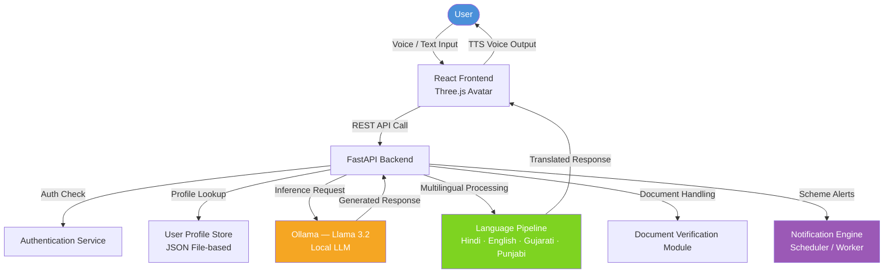
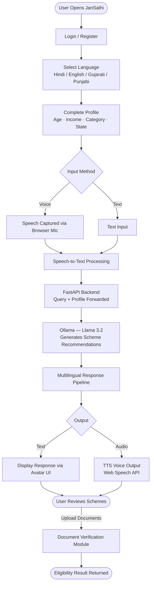

# JanSathi — AI-Powered Citizen Assistance Platform

> A multilingual, voice-first platform that helps citizens discover relevant government schemes based on their personal profile.

---

## Table of Contents

- [Overview](#overview)
- [Features](#features)
- [Architecture Diagram](#architecture-diagram)
- [User Flow Diagram](#user-flow-diagram)
- [Tech Stack](#tech-stack)
- [Supported Languages](#supported-languages)
- [Setup Instructions](#setup-instructions)
- [Folder Structure](#folder-structure)
- [Limitations](#limitations)
- [Future Scope](#future-scope)
- [Author](#author)

---

## Overview

JanSathi ("Jan" = people, "Sathi" = companion) is a citizen assistance platform designed to bridge the gap between government welfare schemes and the people they serve. Users interact with the system using voice in their preferred language, and receive personalized scheme recommendations based on their profile.

The platform currently runs on **Llama 3.2** via Ollama (local inference) and supports voice input/output with a multilingual pipeline covering four Indian languages.

---

## Features

### ✅ Implemented

- **Voice Input & Output** — Users can speak queries; the system responds with synthesized speech using the browser's Web Speech API.
- **Multilingual Support (4 Languages)** — Hindi, English, Gujarati, and Punjabi are fully supported across the UI, TTS, and STT pipeline.
- **Profile-Based Personalization** — Scheme recommendations are filtered based on user profile data (age, income, category, state, etc.).
- **3D Avatar Interface** — A GLB-based avatar rendered with Three.js provides a conversational UI with animations.
- **Document Verification Module** — Users can check document eligibility for specific schemes.
- **Authentication** — User authentication handled via OTP.
- **Notification Engine** — Standalone Python scheduler for scheme alerts and reminders.
- **Local LLM via Ollama (Llama 3.2)** — All AI inference runs locally using `llama3.2` through Ollama.

### 🚧 Planned

- **Full RAG Pipeline** — Retrieval-Augmented Generation using Qdrant vector database and document embeddings.
- **Airavata + IndicTrans Integration** — For production-grade Indic language translation.
- **Bhashini TTS** — High-quality Text-to-Speech for Indian languages in production.
- **vLLM for Scalable Inference** — Replace Ollama with vLLM for high-throughput, production deployments.
- **PostgreSQL + Redis + Qdrant Architecture** — Full database layer for persistent storage, caching, and vector search.
- **WhatsApp Notifications** — Notify users of scheme deadlines and updates via WhatsApp.
- **More Language Support** — Tamil, Telugu, Bengali, Marathi, and other scheduled Indian languages.
- **Cloud Deployment** — Deployment on Tata Cloud or hybrid infrastructure.

---

## Architecture Diagram



---

## User Flow Diagram



---

## Tech Stack

| Layer              | Technology                                              |
|--------------------|---------------------------------------------------------|
| Frontend           | React, TypeScript, Three.js (GLB avatar rendering)      |
| Backend            | FastAPI (Python)                                        |
| AI / LLM           | Ollama — **Llama 3.2** (local inference)                |
| Voice              | Web Speech API — STT & TTS (browser-native)            |
| Languages          | Hindi, English, Gujarati, Punjabi                       |
| Storage            | JSON file-based (no database currently)                |
| Auth               | API-based authentication                                |
| Notification       | Standalone Python scheduler/worker                     |
| Planned AI         | Airavata, IndicTrans, vLLM, Bhashini TTS               |
| Planned DB         | PostgreSQL, Redis, Qdrant                              |

---

## Supported Languages

| Language | Code | UI | Voice Input (STT) | Voice Output (TTS) |
|----------|------|----|--------------------|---------------------|
| English  | `en` | ✅ | ✅                 | ✅                  |
| Hindi    | `hi` | ✅ | ✅                 | ✅                  |
| Gujarati | `gu` | ✅ | ✅                 | ✅                  |
| Punjabi  | `pa` | ✅ | ✅                 | ✅                  |

> More languages (Tamil, Telugu, Bengali, Marathi) are planned for future releases.

---

## Setup Instructions

> ⚠️ This project requires **3 terminals running simultaneously**.

### Prerequisites

- [Ollama](https://ollama.com/) installed with Llama 3.2 pulled
- Python 3.11+
- Node.js 18+

```bash
# Pull the required model
ollama pull llama3.2
```

---

### Terminal 1 — Start Ollama (LLM Server)

```bash
ollama serve
```

---

### Terminal 2 — Start Backend (FastAPI)

```bash
cd backend
pip install -r requirements.txt
python -m uvicorn app.main:app --reload --port 8000
```

---

### Terminal 3 — Start Frontend (React)

```bash
cd frontend
npm install
npm run dev
```

---

### Optional — Start Notification Engine

```bash
cd notification-engine
python worker.py
```

---

## Folder Structure

```
Jansaathi/
│
├── frontend/                        # React + TypeScript frontend
│   ├── src/
│   │   ├── components/
│   │   │   ├── Avatar.tsx           # Three.js GLB avatar renderer
│   │   │   ├── GenieIntro.tsx       # Intro animation
│   │   │   ├── LanguageSelect.tsx   # Language picker (4 languages)
│   │   │   ├── ActionSelect.tsx     # Icon-based action picker
│   │   │   ├── ProfileForm.tsx      # Multilingual profile form
│   │   │   ├── SchemeList.tsx       # Scheme recommendation cards
│   │   │   ├── NotificationPanel.tsx
│   │   │   └── Logo.tsx
│   │   ├── services/
│   │   │   ├── tts.ts               # Text-to-speech (Web Speech API)
│   │   │   └── storage.ts           # LocalStorage persistence
│   │   ├── types.ts                 # TypeScript types + demo data
│   │   ├── App.tsx                  # Main app with full UX flow
│   │   └── main.tsx
│   ├── index.html
│   ├── package.json
│   └── vite.config.ts
│
├── backend/                         # FastAPI Python backend
│   ├── app/
│   │   ├── api/
│   │   │   ├── chat.py              # Chat endpoints
│   │   │   ├── schemes.py           # Scheme matching + verification
│   │   │   ├── notifications.py     # Notification CRUD
│   │   │   ├── profile.py           # Profile management
│   │   │   └── health.py            # Health check
│   │   ├── services/
│   │   │   └── ai_service.py        # Ollama / Llama 3.2 integration
│   │   ├── models/
│   │   │   └── models.py            # Pydantic models
│   │   ├── utils/
│   │   │   └── storage.py           # JSON file store
│   │   └── main.py                  # FastAPI app entry point
│   ├── data/                        # Auto-created JSON data files
│   └── requirements.txt
│
├── notification-engine/             # Standalone notification scheduler
│   ├── worker.py                    # Main worker loop
│   └── scheduler.py                 # Schedule rules
│
├── .gitignore
├── .gitattributes
├── package.json
├── package-lock.json
└── README.md
```

---

## Limitations

- **No RAG pipeline yet** — The LLM does not retrieve from a live scheme database. Responses depend on Llama 3.2's pre-trained knowledge, which may be incomplete or outdated for specific schemes.
- **Local inference only** — Ollama with Llama 3.2 is not suited for concurrent multi-user production deployments.
- **4 languages only** — Only Hindi, English, Gujarati, and Punjabi are currently supported. Other Indian languages are not yet available.
- **Voice quality depends on browser** — TTS/STT uses the browser's Web Speech API, which varies in accuracy and language support across devices and browsers.
- **No persistent database** — User profiles and session data are stored in JSON files, not a production-grade database.
- **Document verification is partial** — The module accepts uploads but full automated verification logic is not complete.

---

## Future Scope

- Integrate a **full RAG pipeline** with Qdrant to ground LLM responses in an up-to-date government scheme database.
- Replace browser STT/TTS with **Bhashini** for accurate Indic language speech support.
- Add **Airavata + IndicTrans** for robust multilingual translation across all 22 scheduled Indian languages.
- Scale inference using **vLLM** to handle concurrent users in production.
- Build out the **PostgreSQL + Redis + Qdrant** data architecture for persistence, caching, and vector search.
- Send scheme deadline reminders and updates via **WhatsApp notifications**.
- Deploy on **Tata Cloud or hybrid infrastructure** for reliability and data residency compliance.
- Expand language coverage to Tamil, Telugu, Bengali, and Marathi.

---

## Author

**JanSathi** is developed as an initiative to make government welfare schemes more accessible to citizens through conversational AI.

---

> *This project is under active development. Features marked 🚧 are not yet available.*
